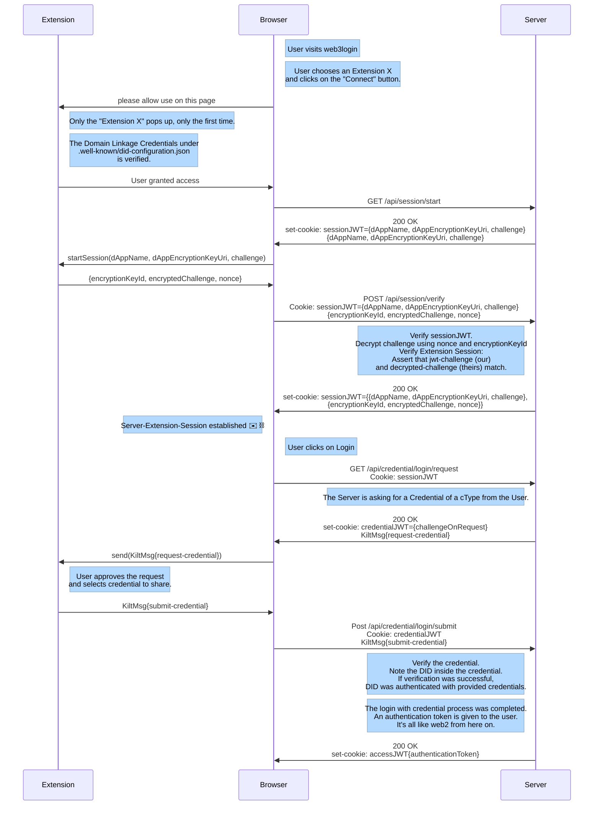

# web3-login-demo

_Explanatory Tutorial for websites to implement logging in with web3 credentials using the KILT Protocol._

## Intro

This project demonstrates how to enable **login using KILT Protocol**.
It is an educational project, everything is broken down to little steps and has explanations to ease your understanding.

During [the login procedure](#login-process), the user is required to present a credential.
You can decide which credentials to accept.
They could be issued by yourself or by other attesters.

If you require the credentials to be attested by yourself, the credentials become similar to membership cards.
If you also accept credentials from other attesters, you open your system up to also accept other membership cards.

This means that users don't not need to setup an account and password just for your website.
Additionally, this avoids third parties (usually powerful data-collecting companies) from tracking your interactions with your clients.
There is no trace on the KILT blockchain about the interaction between you and your client.

In order for a **dApp** to support logging in with KILT Credentials, it needs:

1. It's [on-chain DID](#Environment-Variables)

- This DID is used so that the user knows the parties to whom they talk.

2. It's [Domain Linkage Credential](#Well-Known-DID-Configuration)

- Bind your DID to a specific domain.
- This prevents Man-in-the-Middle attacks.
- Also known as the _well-known-did-configuration_.

3. A CType to request from the user

- The type of credentials the dApp considers valid.
- The CType defines the structure and semantics of the credential you accept.
- The issuer of this credentials is important.
  Anyone can issue a credential of a CType, but not everybody can be trusted as a source of truth.
- To be secure, your dApp should accept credentials coming from it's _trusted attesters_.

If you don't have some of the above, don't worry, we help you get them on the sections below.

After setting up and running this project locally on your computer, you will have representation of how the [login process](#Process) works.
You are free to copy code from here, but we do encourage you to customize the code for your specific use case.
Just keep in mind to follow the [specifications](https://github.com/KILTprotocol/spec-ext-credential-api) to retain compatibility with the wallets/extensions.

If you are rather looking for a Plug-and-Play solution, we provide [the openDID project](https://github.com/KILTprotocol/openDID) which implements the [OpenID-Connect implicit flow](https://openid.net/specs/openid-connect-implicit-1_0.html#ImplicitFlow) to authenticate your users.
[OpenDID ](https://github.com/KILTprotocol/openDID) substantially reduces the complexity of integration.

## Users requirements

It is important, that the dApp and the user interact with information from the same chain.
There is the **KILT Test Chain** aliased **_Peregrine_**.
And there is the **production KILT Chain** aliased **_Spiritnet_**.

For a user to log in with KILT, it requires:

1. A compatible wallet or extension.

- The wallet is required to follow the [KILT credential API specifications](https://github.com/KILTprotocol/spec-ext-credential-api).

- The **Sporran Wallet** is one example for such an extension.

  - [Download Sporran for **_Peregrine_** here](https://github.com/BTE-Trusted-Entity/sporran-extension/releases).
  - [Download Sporran for **_Spiritnet_** here](https://www.kilt.io/services/sporran).

2. An on-chain DID

- If you are using Sporran, here is [how to get a DID.](https://www.kilt.io/build-your-identity)

3. A Credential that the dApp considers valid.

- This means the credential has to (simultaneously) be:

  - one of the cTypes accepted by the dApp.
  - issued by one of the dApps _trusted attesters_.

## Steps to launch the dApp locally

1. [Clone repository and **install** all necessary modules.](#Installation)
2. [Define your **environment variables**](#Environment-Variables)
3. [Build a **Domain Linkage Credential**](#Well-Known-DID-Configuration)
4. [**Start** your dApp](#Starting-the-dApp-locally)

## Prerequisite

This code makes use of a mix of different technologies.
If you are not familiar with some of these, we recommend to first get an overview about them.

- [decentralized identifier (DID)](https://docs.kilt.io/docs/concepts/did)
- [typescript](https://www.typescriptlang.org/)
- [JSON](https://www.json.org/json-en.html)
- [JSON Web Token (JWT)](https://en.wikipedia.org/wiki/JSON_Web_Token)
- [express.js](https://expressjs.com/)
- [react.js](https://react.dev/)

## Installation

After [cloning the repository](https://docs.github.com/en/repositories/creating-and-managing-repositories/cloning-a-repository), to install all required modules, run:

- `yarn install`.

## Environment Variables

Before you can run this project, you need to setup your environment variables.
This variables specify which blockchain we use and they hold the secrets for your DID and to sign JWTs.
Defining them is part of the set up of your project.

The `.env`-file should be on the root directory of this repository.
_This file maybe hidden._
It is included on the `.gitignore` list so that the secrets that are contained in the file never get pushed to GitHub.
There is a `.env.example`-file that also list how your variables should be named.
The `.env`-file should be added to the same level (directory) where `.env.example`-file is found.

The following variables are required:

- `WSS_ADDRESS` = _This is the websocket address of the RPC node_
- `FRONTEND_PORT` = _This is the local Port on which your website (client-side) would be reachable_
- `BACKEND_PORT` = _This is the local Port on which your server would be reachable_
- `DAPP_ACCOUNT_MNEMONIC` = _This is the mnemonic of the Kilt account paying for all transactions_
- `DAPP_DID_MNEMONIC` = _This is the mnemonic of the Kilt DID that identifies your dApp_
- `DAPP_DID_URI` = _This is the URI of the Kilt DID that identifies your dApp_
- `DAPP_NAME` = _This should be a custom name for your dApp_
- `JWT_SIGNER_SECRET` = _This is secret key (string) that signs the Json-Web-Tokens before saving them in the Cookies_
- `CTYPE_HASH` = _This is the type of credential (CType) your dApp will request from users for login. If you want to specify more than one CType, you can do so by adding a '/' sign between them_
- `TRUSTED_ATTESTERS` = _This is a list of attester DIDs (CSV, separated by ','). Only credentials issued by these attesters will be considered valid. If you are using more than one CType, indicate the groups of trusted attesters by respectively separating them with a '/' sign._
- `REQUIRED_PROPERTIES` = _This is a subset of CType properties (CSV, separated by ',') required to be exposed on credential presentation. If you are using more than one CType, indicate the groups of required properties by respectively separating them with a '/' sign._

### Info about Example/Recommended cTypes

This table provides information on recommended cTypes for SocialKYC credential issuance. SocialKYC is a platform that issues credentials based on user social media presence. The cType-hash is consistent across both Spiritnet and Peregrine to ensure interoperability and consistent verification across the KILT network by using universal identifiers stored on archive nodes.

#### SocialKYC on Spiritnet:

did:kilt:4pnfkRn5UurBJTW92d9TaVLR2CqJdY4z5HPjrEbpGyBykare

#### SocialKYC on Peregrine:

did:kilt:4pehddkhEanexVTTzWAtrrfo2R7xPnePpuiJLC7shQU894aY

Here are the cTypes recommended for SocialKYC:

| Title          | CTYPE_HASH                                                         | SocialKYC on Spiritnet                     | SocialKYC on Peregrine                     | Properties                               |
| -------------- | ------------------------------------------------------------------ | ------------------------------------------ | ------------------------------------------ | ---------------------------------------- |
| Email          | 0x3291bb126e33b4862d421bfaa1d2f272e6cdfc4f96658988fbcffea8914bd9ac | [prod. Spiritnet](#SocialKYC-on-Spiritnet) | [prod. Peregrine](#SocialKYC-on-Peregrine) | Email                                    |
| Twitter        | 0x47d04c42bdf7fdd3fc5a194bcaa367b2f4766a6b16ae3df628927656d818f420 | [prod. Spiritnet](#SocialKYC-on-Spiritnet) | [prod. Peregrine](#SocialKYC-on-Peregrine) | Twitter                                  |
| Discord        | 0xd8c61a235204cb9e3c6acb1898d78880488846a7247d325b833243b46d923abe | [prod. Spiritnet](#SocialKYC-on-Spiritnet) | [prod. Peregrine](#SocialKYC-on-Peregrine) | Discriminator, User ID, Username         |
| GitHub         | 0xad52bd7a8bd8a52e03181a99d2743e00d0a5e96fdc0182626655fcf0c0a776d0 | [prod. Spiritnet](#SocialKYC-on-Spiritnet) | [prod. Peregrine](#SocialKYC-on-Peregrine) | GitHubUsername, Username                 |
| Twitch         | 0x568ec5ffd7771c4677a5470771adcdea1ea4d6b566f060dc419ff133a0089d80 | [prod. Spiritnet](#SocialKYC-on-Spiritnet) | [prod. Peregrine](#SocialKYC-on-Peregrine) | User ID, Username                        |
| Telegram       | 0xcef8f3fe5aa7379faea95327942fd77287e1c144e3f53243e55705f11e890a4c | [prod. Spiritnet](#SocialKYC-on-Spiritnet) | [prod. Peregrine](#SocialKYC-on-Peregrine) | First name, Last name, User ID, Username |
| YoutubeChannel | 0x329a2a5861ea63c250763e5e4c4d4a18fe4470a31e541365c7fb831e5432b940 | [prod. Spiritnet](#SocialKYC-on-Spiritnet) | [prod. Peregrine](#SocialKYC-on-Peregrine) | Channel ID, Channel Name                 |

Note: We only recommend these cTypes and properties for SocialKYC verification. Users are advised to select the appropriate properties based on their verification needs.

Additionally, for access to a broader range of CType Hashes, consider visiting the [CType Hub](https://ctypehub.galaniprojects.de/).

### Setup your environment

You have three different options:

1. Using `yarn environment`:

   There is a script to facilitate the generation of the environment variables inside of this repository.
   This script is called `./launchScripts/genesisEnvironmentVariables.ts`. You can execute it by running:

   - `yarn environment`.

   Setting up your environment with this script is a step by step process.
   You will need to run the script repeatedly and follow the instructions that it provides, depending on your project's state.
   After running this script each time, you need to manually copy the output and save it on the `.env`-file .

2. Using the [kilt-distillery-cli](https://github.com/KILTprotocol/kilt-distillery-cli)

   This is a _Command Line Interface_ tool that can help you obtaining this variables and also does other common tasks (unrelated to this project).
   The distillery uses the same key derivation as this repository, which means that it is highly compatible.

3. Without help:

   If you are a _pro_, you could defined and generate them externally and add them to the `.env`-file.
   You would probably have to modify the `generateKeyPairs.ts` files (on the _backend_) to match your key derivation though.

## Well-Known DID Configuration

After having all your environment variables, to build a **Domain Linkage Credential**, execute:

- `yarn did-configuration`.

If you want know more about this, check out the [Identity Foundation Documentation on Well-Known DID Configuration](https://identity.foundation/.well-known/resources/did-configuration/).
[Our dApp documentation also have a section about this.](https://docs.kilt.io/docs/develop/dApp/well-known-did-config)

## Starting the dApp locally

After having all your environment variables and your well-known DID configuration, to start the dApp, run:

- `yarn start`.

## Login Process

After having set up the whole project, when the website is up and running, the login process can take place.
Each user that wants to login would trigger the process that is displayed below.
The process consist of multiple HTTP(S) queries, including extension-api's messages.
Interactions are between the client (browser), the extension/wallet and the server (backend).

A user could trigger the whole process with just one click on the website, for example "Login with extension X" or "Login with extension Y".

On this example project, several (2-3) interactions are need because it is broken down into little steps.
We encourage you to open and read the browser's and backend's consoles.
This should help you understand what is happening on each step, which function is responsible for what, how did the cookies changed.

## Deployed Version

We have deployed this demo dApp as well, making it accessible online.
This allows the developers to compare their results.
It also makes it possible for non-coders to it check out.

Reach the version connected to the **KILT Production Chain** aliased **_Spiritnet_**:

- under: https://login-demo.kilt.io/

Reach the version connected to the **KILT Development Chain** aliased **_Peregrine_**:

- under: https://login-demo-peregrine.kilt.io/

## Build

Running the app locally on your computer doesn't require this step.
It's only necessary when you plan to deploy the app, not for the tutorial.

To obtain a production-ready version of the app, you can compile both the frontend and backend code into Docker images.
For this, after having all your environment variables and your well-known DID configuration, run:

- `yarn build`.
